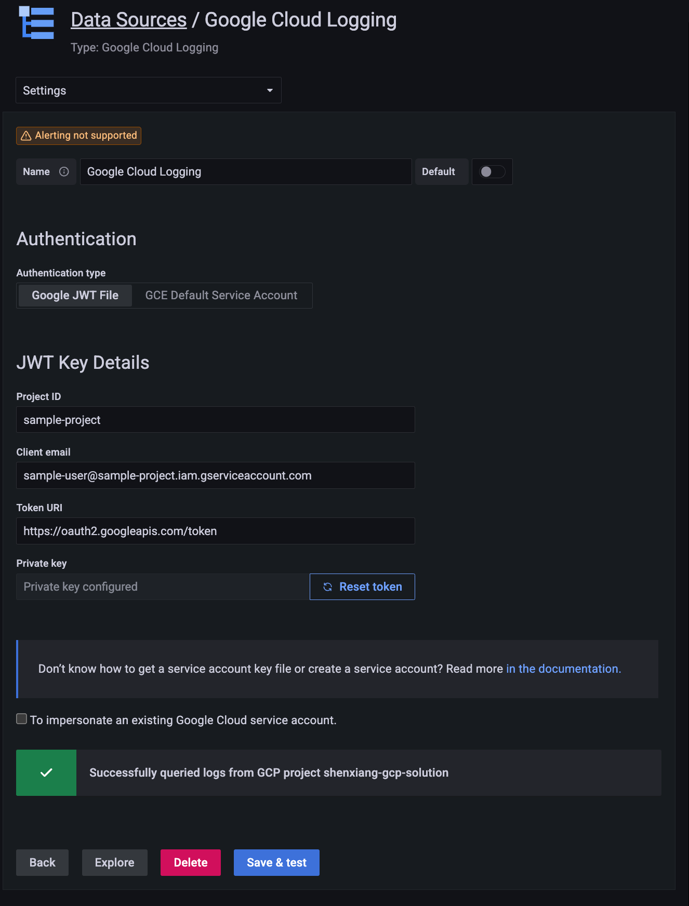

# Google Cloud Logging Data Source

## Overview
The Google Cloud Logging Data Source is a backend data source plugin for Grafana,
which allows users to query and visualize their Google Cloud logs in Grafana.

## Setup

### Download

Download this plugin to the machine Grafana is running on, either using `git clone` or simply downloading it as a ZIP file. For the purpose of this guide, we'll assume the user "alice" has downloaded it into their local directory "/Users/alice/grafana/". If you are running the Grafana server using a user such as `grafana`, make sure the user has access to the directory.

### Enable Cloud Resource Manager API

You need to enable the resource manager API. Otherwise, your cloud projects will not be displayed in the dropdown menu.

You can follow the steps to enable it:

1. Navigate to the [cloud resource manager API page](https://console.cloud.google.com/apis/library/cloudresourcemanager.googleapis.com]) in GCP and select your project
2. Press the `Enable` button

### Generate a JWT file & Assign IAM Permissions

1. If you don't have gcp project, add a new gcp project. [link](https://cloud.google.com/resource-manager/docs/creating-managing-projects#console)
2. Open the [Credentials](https://console.developers.google.com/apis/credentials) page in the Google API Console
3. Click **Create Credentials** then click **Service account**
4. On the Create service account page, enter the Service account details
5. On the `Create service account` page, fill in the `Service account details` and then click `Create and Continue`
6. On the `Grant this service account access to project` section, select the `Logs Viewer` role under `Logging` to the service account. Click `Done`
7. In the next step, click the service account you just created. Under the `Keys` tab and select `Add key` and `Create new key`
8. Choose key type `JSON` and click `Create`. A JSON key file will be created and downloaded to your computer

If you want to access logs in multiple cloud projects, you need to ensure the service account has permission to read logs from all of them.

### Grafana Configuration

1. With Grafana restarted, navigate to `Configuration -> Data sources` (or the route `/datasources`)
2. Click "Add data source"
3. Select "Google Cloud Logging"
4. Provide credentials in a JWT file, either by using the file selector or pasting the contents of the file.
5. If desired, provide a regional [Cloud Logging service endpoint](https://cloud.google.com/vpc/docs/regional-service-endpoints#cloud-logging) in order to only collect logs from a specific log bucket region
6. Click "Save & test" to test that logs can be queried from Cloud Logging.

## Licenses

Cloud Logging Logo (`src/img/logo.svg`) is from Google Cloud's [Official icons and sample diagrams](https://cloud.google.com/icons)

As commented, `JWTForm` and `JWTConfigEditor` are largely based on Apache-2.0 licensed [grafana-google-sdk-react](https://github.com/grafana/grafana-google-sdk-react/)
