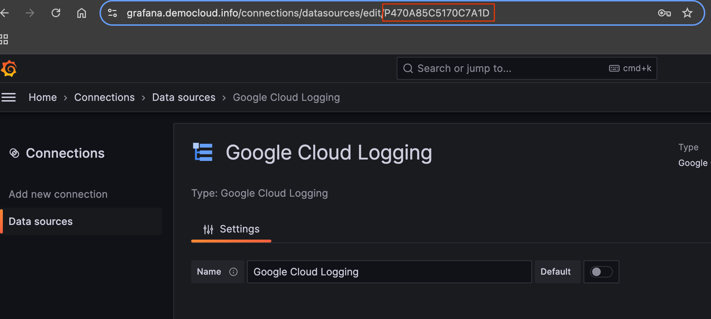

# Data Source Syncer

This CLI tool acts as a scheduled job that remotely syncs data to a given Grafana Cloud Logging data source. This ensures that the Grafana data source has the following set correctly:

* Authentication by refreshing an OAuth2 access token periodically
* The Google Cloud project ID

By regularly refreshing the OAuth2 access token, you can configure Grafana to directly query Google Cloud Logging.

[Google access tokens have a lifetime of 1 hour.](https://cloud.google.com/docs/authentication/token-types#at-lifetime) This script should be scheduled to run every 10 minutes to ensure you have an uninterrupted connection between Grafana and Google Cloud Logging.

## Flags

```bash mdox-exec="bash hack/format_help.sh datasource-syncer"
Usage of datasource-syncer:
  -datasource-uids string
    	datasource-uids is a comma separated list of data source UIDs to update.
  -grafana-api-endpoint string
    	grafana-api-endpoint is the endpoint of the Grafana instance that contains the data sources to update.
  -grafana-api-token string
    	grafana-api-token used to access Grafana. Can be created using: https://grafana.com/docs/grafana/latest/administration/service-accounts/#create-a-service-account-in-grafana
  -insecure-skip-verify
    	Skip TLS certificate verification
  -project-id string
    	Project ID of the Google Cloud Monitoring scoping project to query. Queries sent to this project will union results from all projects within the scope.
  -query.credentials-file string
    	JSON-encoded credentials (service account or refresh token). Can be left empty if default credentials have sufficient permission.
  -tls-ca-cert string
    	Path to the server certificate authority
  -tls-cert string
    	Path to the server TLS certificate.
  -tls-key string
    	Path to the server TLS key.
```
## Scheduled the job using Cloud Run

To deploy and run a serverless data source syncer by using [Cloud Run](https://cloud.google.com/run)
and [Cloud Scheduler](https://cloud.google.com/scheduler), do the following:

1. Choose a project to deploy the data source syncer in. We recommend choosing
   the [scoping project of a multi-project log scope](https://cloud.google.com/logging/docs/log-scope/create-and-manage).
   The data source syncer uses the configured Google Cloud project as the
   scoping project.

   Next, configure and authorize a service account for the data source syncer.
   The following command sequence creates a service account and grants it
   several IAM roles. The first three roles let the service account
   read from the Cloud Logging API and generate service account tokens. The
   last two roles allow the service account to read the Grafana service account
   token from Secret Manager and to invoke Cloud Run:

   ```bash
   # Replace the values if needed
   export PROJECT_ID=YOUR_LOGGING_PROJECT_ID
   export SA_DS_SYNCER=grafana-ds-syncer-sa
   export REGION=us-central1 # The Google Cloud region where you want to run your Cloud Run job, such as us-central1.


   gcloud config set project ${PROJECT_ID} \
   &&
   gcloud iam service-accounts create ${SA_DS_SYNCER} \
   &&
   gcloud projects add-iam-policy-binding ${PROJECT_ID} \
   --member=serviceAccount:${SA_DS_SYNCER}@${PROJECT_ID}.iam.gserviceaccount.com \
   --role=roles/logging.viewer \
   --condition=None \
   && \
   gcloud projects add-iam-policy-binding ${PROJECT_ID} \
   --member=serviceAccount:${SA_DS_SYNCER}@${PROJECT_ID}.iam.gserviceaccount.com \
   --role=roles/logging.viewAccessor \
   --condition=None \
   && \
   gcloud projects add-iam-policy-binding ${PROJECT_ID} \
   --member=serviceAccount:${SA_DS_SYNCER}@${PROJECT_ID}.iam.gserviceaccount.com \
   --role=roles/iam.serviceAccountTokenCreator \
    --condition=None \
   && \
   gcloud projects add-iam-policy-binding ${PROJECT_ID} \
   --member=serviceAccount:${SA_DS_SYNCER}@${PROJECT_ID}.iam.gserviceaccount.com \
   --role=roles/secretmanager.secretAccessor \
    --condition=None \
   && \
   gcloud projects add-iam-policy-binding ${PROJECT_ID} \
   --member=serviceAccount:${SA_DS_SYNCER}@${PROJECT_ID}.iam.gserviceaccount.com \
   --role=roles/run.invoker \
    --condition=None
   ```

1. Build the container image:
    ```bash
    # Create the artifact registry to store the image
    gcloud artifacts repositories create datasource-syncer-repo \
    --repository-format=docker \
    --location=${REGION} --description="Docker repository for Grafana data source syncer"
    
    gcloud builds submit --region=${REGION} --tag ${REGION}-docker.pkg.dev/${PROJECT_ID}/datasource-syncer-repo/datasource-syncer
    ```

1. Determine the URL of your Grafana instance, for example
   `https://yourcompanyname.grafana.net` for a Grafana Cloud deployment. Your
   Grafana instance needs to be accessible from Cloud Run, meaning it
   needs to be accessible from the wider internet.

   If your Grafana instance is not accessible from the wider internet, we
   recommend deploying the data source syncer on Kubernetes instead.

1. Choose the Grafana Cloud Logging data source to
   use for Cloud Logging, which can be either a new or a
   pre-existing data source, and then find and write down the data
   source UID. The data source UID can be found in the last
   part of the URL when exploring or configuring a data source, for example
   `https://yourcompanyname.grafana.net/connections/datasources/edit/`**_grafana_datasource_uid_**.

   **Do not copy the entire datasource URL**. Copy only the unique identifier in
   the URL.

    

1. [Set up a Grafana service account](https://grafana.com/docs/grafana/latest/administration/service-accounts/#create-a-service-account-in-grafana) by creating the
   service account and generating a token for the account to use:

    1. In the Grafana navigation sidebar, click
       **Administration > Users and Access > Service Accounts**.

    1. Create the service account in Grafana by clicking **Add service
       account**, giving it a name, and granting it the "Data Sources >
       Writer" role. Make sure you hit the **Apply** button to assign the role.
       In older versions of Grafana, you can use the "Admin" role
       instead.

    1. Click **Add service account token**.

    1. Set the token expiration to "No expiration" and click **Generate
       token**, then copy the generated token to the clipboard for use as
       GRAFANA_SERVICE_ACCOUNT_TOKEN in the next step:

       

1. Set the following 
   variables using the results of the previous steps:

    ```bash
    # These values are required.
    export GRAFANA_INSTANCE_URL=YOUR_GRAFANA_INSTANCE_URL # The Grafana instance URL from step 3. This is a URL. Include "http://" or "https://".
    export GRAFANA_DATASOURCE_UID=YOUR_GRAFANA_DATASOURCE_UID # The Grafana data source UID from step 4. This is not a URL.
    export GRAFANA_SERVICE_ACCOUNT_TOKEN=YOUR_GRAFANA_SERVICE_ACCOUNT_TOKEN # The Grafana service account token from step 5.
    ```

1. Create a secret in Secret Manager:

   ```bash
   gcloud secrets create datasource-syncer --replication-policy="automatic" && \
   echo -n ${GRAFANA_SERVICE_ACCOUNT_TOKEN} | gcloud secrets versions add datasource-syncer --data-file=-
   ```

1. Run the following command to create a YAML file and name it
   `cloud-run-datasource-syncer.yaml`:

   ```bash
   cat > cloud-run-datasource-syncer.yaml <<EOF
   apiVersion: run.googleapis.com/v1
   kind: Job
   metadata:
     name: logging-datasource-syncer-job
   spec:
     template:
       spec:
         taskCount: 1
         template:
           spec:
             containers:
             - name: datasource-syncer
               image: ${REGION}-docker.pkg.dev/${PROJECT_ID}/datasource-syncer-repo/datasource-syncer
               args:
               - "--datasource-uids=${GRAFANA_DATASOURCE_UID}"
               - "--grafana-api-endpoint=${GRAFANA_INSTANCE_URL}"
               - "--project-id=${PROJECT_ID}"
               env:
               - name: GRAFANA_SERVICE_ACCOUNT_TOKEN
                 valueFrom:
                   secretKeyRef:
                     key: latest
                     name: datasource-syncer
             serviceAccountName: ${SA_DS_SYNCER}@${PROJECT_ID}.iam.gserviceaccount.com
   EOF
   ```

   Then run the following command to create a Cloud Run job using the
   YAML file:

   ```bash
   gcloud run jobs replace cloud-run-datasource-syncer.yaml --region ${REGION}
   ```

1. Create a schedule in Cloud Scheduler to run the Cloud Run job
   every 10 minutes:

   ```bash
   gcloud scheduler jobs create http datasource-syncer \
   --location ${REGION} \
   --schedule="*/10 * * * *" \
   --uri="https://${REGION}-run.googleapis.com/apis/run.googleapis.com/v1/namespaces/${PROJECT_ID}/jobs/logging-datasource-syncer-job:run" \
   --http-method POST \
   --oauth-service-account-email=${SA_DS_SYNCER}@${PROJECT_ID}.iam.gserviceaccount.com
   ```

   Then force run the scheduler you just created:

   ```bash
   gcloud scheduler jobs run datasource-syncer --location ${REGION}
   ```

   It can take up to 15 seconds for the data source to be updated.

1. Go to your newly configured Grafana data source and verify the **Access Token**
   field has the value `configured` and the **Project ID** field displays the Google
   Cloud Project ID you configured (e.g., the value of your ${PROJECT_ID} variable).

   You might have to refresh the page. Once verified, go to the bottom
   of the page, select **Save & test**, and ensure you see a green checkmark saying that
   the datasource is properly configured. You need to select **Save & test** at
   least once to ensure that label autocompletion in Grafana works.
